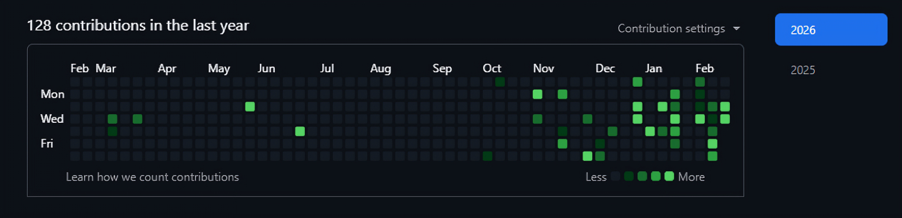

#  Hello, I'm Ahmad Raza !

  

    

  

    
  

  

    <h3>🚀 FROM CONCEPT TO CREATION - LET'S MAKE IT HAPPEN!</h3>
    

      <em>I thrive on crafting dynamic web applications and delivering seamless user experiences.</em>
    

  

## Tech Stack

### Backend

  

### Frontend

  

### Tools & Practices

  

## 📊 GitHub Analytics

  

## 📫 **Let's Connect & Collaborate!**

  
  
  
  
  

---

  

  

---

  
    Building scalable backend systems and production-grade applications.
     
    Open to <b>collaborations, freelance projects, and full-time opportunities </b> — let’s build something impactful.
  

